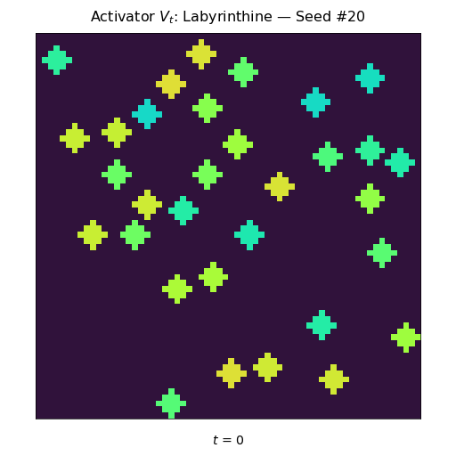
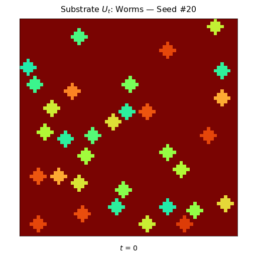
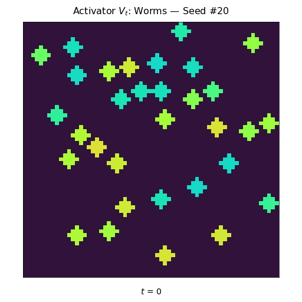

# GREYSCOTT_SIMULATION

## Create and activate Conda environment

```bash
cd esp_simulation
conda env create -f environment.yaml
conda activate grey_scott
```

### Notes
- Most of the packages are common, so you may already have these installed


## Test the code

```bash
python -m pytest
```

## Create a dataset

### Program: [create_dataset.py](./create_dataset.py)

#### `create_dataset.py` Command-Line Options

| Option                                | Description                                                        | Choices/Types                                                                              |
|---------------------------------------|--------------------------------------------------------------------|--------------------------------------------------------------------------------------------|
| `-h, --help`                          | Show help message and exit                                         | —                                                                                          |
| `--debug, -d`                         | Enables logging with debug level verbosity                         | Flag (presence means `'On'`)                                                               |
| `--ntasks`                            | Number of parallel tasks (CPU cores)                               | Any integer (e.g., `1`, `4`)                                                               |
| `--seed-step`                         | Number of seeds to be processed and written at a time              | Any integer (default: `100`)                                                               |
| `--min-seed`                          | Start seed for generating simulations                              | Any positive integer (default: `1`)                                                        |
| `--max-seed`                          | End seed for generating simulations                                | Any positive integer (default: `5`)                                                        |
| `--grid-length`                       | Length of one side of 2D grid                                      | Any integer > 4 (default: `32`)                                                            |
| `--max-iterations`                    | Maximum Euler integration steps                                    | Any integer (default: `1000`)                                                              |
| `--patch-radius`                      | Half-width of central perturbation                                 | Any integer (default: `20`)                                                                |
| `--patch-prob`                        | Probability of placing each patch                                  | Float between `0.0` and `1.0` (default: `0.5`)                                             |
| `--output-path`                       | Path to directory to create `--output-folder` and save data        | String (e.g., `"./results"`)                                                               |
| `--output-folder`                     | Output folder name to save simulation data                         | String (default: `"esp_dataset"`)                                                          |
| `--save-states`                       | When to save intermediate states                                   | String options:<br>• `all`<br>• `none`<br>• `interval-<N>`<br>• `first-<N>`<br>• `base-<B>`<br>Multiple options can be chained (e.g. `"first-10,interval-50"`) |


### Example command

```bash
python create_dataset.py \
--output-folder "greyscott_dataset_500" \
--min-seed 1 \
--max-seed 500 \
--seed-step 100 \
--ntasks 2 \
--grid-length 64 \
--patch-prob 0.5 \
--patch-radius 2 \
--max-iterations 1500 \
--save-states "first-20,interval-100"
```

> Each simulation run uses a unique seed in range [`--min-seed`, `--max-seed`]
> - This allows simulations to have variable outputs that can be reproduced
> - A random pattern preset is selected (w/ seeded rng)
> - Initial states for `U` and `V` are randomly initialized with patches
> - A patch is "born" or not based on the `--patch-prob` 

## Visualize a dataset

### Program: [visualize_dataset.py](./visualize_dataset.py)

#### `visualize_dataset.py` Command-Line Options
| Option                      | Description                                                                   | Choices/Types                  | Default         |
|-----------------------------|-------------------------------------------------------------------------------|--------------------------------|-----------------|
| `-h`, `--help`              | Show help message and exit                                                    | —                              | —               |
| `-d`, `--debug`             | Enables logging with debug level verbosity                                    | Flag (on if present)           | `false`         |
| `--data-file DATA_FILE`     | Path to the input HDF5 file with saved simulation runs                        | String (file path)             | **required**    |
| `--random-seed RANDOM_SEED`| Random seed for selecting samples                                             | Integer                        | `20`          |
| `--num-samples NUM_SAMPLES`| Number of simulation samples to visualize                                     | Integer                        | `1`             |
| `--output-folder`           | Directory where images and gifs will be saved (created if it doesn't exist)              | String (path to folder)        | **required**    |
| `--gif-fps GIF_FPS`                 | Frames per second for gif playback                                            | Integer                        | `20`            |
| `--gif-delay GIF_DELAY`                 | Delay seconds between gif playback loop                                          | Integer                        | `3`            |
| `--gif-cmap CMAP`               | Colormap for gif plots, perceptually uniform preferred (Matplotlib-compatible)                            | String (e.g. `'turbo'`)      | `'turbo'`     |
| `--image-cmap CMAP`               | Colormap for image plots, diverging preferred (Matplotlib-compatible)                            | String (e.g. `'seismic'`)      | `'seismic'`     |

### Example command

```bash
python visualize_dataset.py \
--data-file "greyscott_dataset_500/greyscott_64x64_1-500.hdf5" \
--output-folder "greyscott_dataset_500/sample_viz" \
--random-seed 24 \
--num-samples 20 \
--gif-fps 10 \
--gif-delay 2 \
--gif-cmap "turbo" \
--image-cmap "seismic"
```

## Grey-Scott Pattern Presets

> | Pattern        |$F$ (Feed) | $k$ (Kill) | $d_u$ | $d_v$ |
> |----------------|-------|-------|------|------|
> | Coral Growth   | 0.055 | 0.062 | 0.16 | 0.08 |
> | Labyrinthine   | 0.037 | 0.060 | 0.16 | 0.08 |
> | Holes          | 0.039 | 0.058 | 0.16 | 0.08 |
> | Spots          | 0.029 | 0.062 | 0.16 | 0.08 |
> | Worms          | 0.078 | 0.061 | 0.16 | 0.08 |

Reference: [Visual-PDE: Grey-Scott Model](https://visualpde.com/nonlinear-physics/gray-scott.html)

| Coral Growth (U) | Coral Growth (V) |
|:----------------:|:----------------:|
|  |  |

| Labyrinthine (U) | Labyrinthine (V) |
|:----------------:|:----------------:|
|  |  |

| Holes (U) | Holes (V) |
|:---------:|:---------:|
|  |  |

| Spots (U) | Spots (V) |
|:---------:|:---------:|
|  |  |

| Worms (U) | Worms (V) |
|:---------:|:---------:|
|  |  |


## Grey-Scott Equations

### Definitions

> | Symbol     | Category      | Description                                         |
> |------------|---------------|-----------------------------------------------------|
> | $u_{i,j}$  | Concentration | Substrate U concentration at grid cell $(i,j)$      |
> | $v_{i,j}$  | Concentration | Activator V concentration at grid cell $(i,j)$      |
> | $d_{u}$    | Diffusion     | Controls how quickly U spreads across the grid      |
> | $d_{v}$    | Diffusion     | Controls how quickly V spreads across the grid      |
> | $F$        | Rate          | Adds $F\,(1 - u_{i,j})$ to $u_{i,j}$ each step      |
> | $k$        | Rate          | Subtracts $k\,v_{i,j}$ from $v_{i,j}$ each step     |


### Discrete Laplacian + Periodic BC

```math
\begin{align*}
(\nabla^2 u)_{i,j} 
&= 
-4\,u_{i,j} 
+ u_{i+1,j} + u_{i-1,j} + u_{i,j+1} + u_{i,j-1}
\\[1ex]
(\nabla^2 v)_{i,j} 
&= 
-4\,v_{i,j} 
+ v_{i+1,j} + v_{i-1,j} + v_{i,j+1} + v_{i,j-1}
\end{align*}
```

> **Discrete Laplacian:** Approximates diffusion of each species ($u$ or $v$) with a 4-neighbor stencil operation </br>
> **Periodic BC:** Edges “wrap around” so boundary cells are connected (or adjacent)


### Forward Operators (Euler‐step, $\Delta t = 1$)

```math
\begin{align*}
u_{i,j} &\leftarrow\,
u_{i,j}
+ d_u\,(\nabla^2 u)_{i,j}
- R_{i,j}
+ F\,\bigl(1 - u_{i,j}\bigr)
\\[1ex]
v_{i,j} &\leftarrow\,
v_{i,j}
+ d_v\,(\nabla^2 v)_{i,j}
+ R_{i,j}
- (F + k)\,v_{i,j}
\end{align*}
```

> **Interpretation:** New value is the old value plus the sum of all terms (`diffusion`, `reaction`, `feed`, and `kill`) at time $t$

> | Term       | Expression                              | Description                                                   |
> |------------|-----------------------------------------|---------------------------------------------------------------|
> | Diffusion  | $d_{u}\,(\nabla^{2}u)$, $d_{v}\,(\nabla^{2}v)$ | Spreads each species to its four neighbors                    |
> | Reaction   | $R_{i,j} = u_{i,j}\,(v_{i,j})^{2}$     | Removes $u_{i,j}$ and adds $v_{i,j}$                      |
> | Feed       | $F\,(1 - u_{i,j})$                   | Increases $u$ when $u_{i,j} < 1$                            |
> | Kill       | $(F + k)\,v_{i,j}$                    | Decreases $v$ by combined feed-kill and decay               |